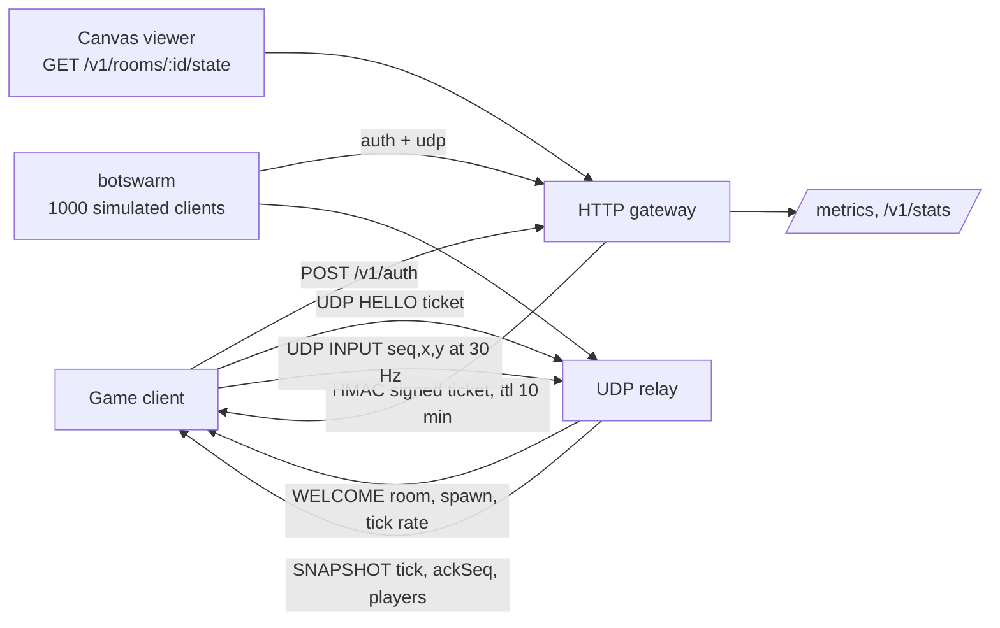

# udp-realtime-gameserver

A **30 Hz UDP realtime game server in Go**, with the parts that are easy to get wrong handled on
purpose: the server owns player movement, players join with an HMAC signed ticket, silent players
are kept as ghosts instead of popping out of the world, and a room nobody is playing in is
collected instead of costing money forever.

It ships with a **canvas viewer** and a **bot swarm** load generator, both of which are how the
numbers below were produced.

```bash
$ make run            # relay on udp :9000, gateway + viewer on http :8080
$ make load CCU=1000  # 1000 simulated clients, 30 inputs/s each
```

```
--- botswarm report ---
players connected      : 1000 / 1000
snapshots received     : 449868 (30.0 per client per second)
client receive rate    : 1354.9 KiB/s
rtt p50 / p95 / p99    : 108µs / 13.539ms / 17.435ms  (14000 samples)
client errors          : 0 (bad frames: 0, never welcomed: 0)
clients that reconciled: 66350 (a client that ignores AckSeq would be corrected by the server instead)

--- relay (from /v1/stats) ---
packets in / out       : 465002 / 578695
bytes in / out         : 3.3 MiB / 42.1 MiB
tick loop p50/p95/p99  : 5032 / 17961 / 19709 us (budget 33333 us)
clamped inputs         : 0 (server authority)
tick budget used (p95) : 53.88%
```

## What this demonstrates

- **Server authority over movement, not over trust.** Clients send `INPUT{seq, x, y}`; the relay
  applies the move only if it fits in an 800 cm/s budget (`protocol.Clamp`) and counts the ones
  that did not. A modified client cannot teleport; the honest one never notices.
- **A binary protocol sized for the tick rate.** Seven bytes per input, seven bytes per player per
  snapshot (position quantised to centimetres in an `int16`), so a 10 player room snapshot is
  74 bytes and 1000 players cost ~1.3 MiB/s to broadcast at 30 Hz.
- **Identity without accounts.** The relay verifies a short lived HMAC ticket minted over HTTP by
  the game backend. It has no users, passwords or sessions of its own, which is what lets it stay
  a dumb, restartable component.
- **One session per player.** A second connection for the same ticket replaces the first one, and
  the replaced client is told why instead of silently going quiet.
- **Ghosts and garbage collection.** A player whose input stops is flagged as a ghost with its last
  known position (so peers keep interpolating) and dropped after a timeout; a room with no activity
  is closed and its players are told the room is gone. Rooms are region bucketed, so a match never
  spans two continents.
- **Backpressure and self defence.** Inputs above 60/s are dropped, malformed frames get an
  `ERROR` frame, unknown frames never panic the read loop, and the process survives every one of
  those paths - all of it covered by tests.
- **Client-side prediction and reconciliation, measured.** `AckSeq` in every snapshot lets a client
  rewind to the last position the server confirmed and replay what it has not processed yet. The
  load test is the evidence: see "what the load test found" below.
- **A real answer to "how many players per box?"** Not a guess: the tick loop p50/p95, RTT
  percentiles, packet rates and the fraction of the 33.3 ms budget in use, from an actual run.

## Architecture



## Protocol

Every frame is binary, big endian, one byte kind first.

**client to relay**

| kind | frame | layout |
|---:|---|---|
| 1 | `HELLO` | `[1][tokenLen u16][token]` |
| 2 | `INPUT` | `[2][seq u16][x i16][y i16]` - 7 bytes, 30 Hz |
| 3 | `PING` | `[3][clientTime u64]` |

**relay to client**

| kind | frame | layout |
|---:|---|---|
| 128 | `WELCOME` | `[128][playerId u16][roomId u16][tickRate u8][spawnX i16][spawnY i16][serverTime u64]` |
| 129 | `SNAPSHOT` | `[129][tick u32][ackSeq u16][count u8]` + `count * [id u16][flags u8][x i16][y i16]` |
| 130 | `PONG` | `[130][clientTime u64][serverTick u32]` |
| 131 | `ERROR` | `[131][code u8][msgLen u8][msg]` |

Positions are centimetres in an `int16`: a 300 x 300 m arena with 1 cm precision. Snapshot flags:
`1` ghost (no input recently, position is the last known one), `2` idle. Error codes: `1` bad frame,
`2` bad token, `3` no room, `4` room full.

## Game rules the relay enforces

| rule | value | where |
|---|---|---|
| players per room | 10 | `MaxPlayersPerRoom` |
| snapshot rate | 30 Hz (33.3 ms) | `TickRate` |
| max speed | 800 cm/s, clamped per input | `MaxSpeed` |
| input rate limit | 60/s (extra inputs dropped) | `MaxInputPerSecond` |
| ghost after | 200 ms without input | `GhostAfter` |
| ghost dropped after | 5 s without input | `GhostDropAfter` |
| idle room closed | 30 s without input | `IdleTimeout` |
| max rooms per process | 1000 | `MaxRooms` |
| ticket lifetime | 10 min | gateway `TokenTTL` |

## Quickstart

Requires Go 1.24+; Docker is optional.

```bash
git clone https://github.com/lasttoss/udp-realtime-gameserver.git
cd udp-realtime-gameserver

make run                       # or: go run ./cmd/relay
open http://localhost:8080    # the canvas viewer
make load CCU=100 DURATION=15s # in another terminal
```

In Docker:

```bash
make up      # docker compose up --build, then the smoke test
make down
```

Ports taken? `make run` honours `RELAY_ADDR`, `HTTP_ADDR` and `RELAY_ADVERTISE`; compose reads
`HTTP_PORT` / `RELAY_PORT` / `RELAY_ADVERTISE` from `.env` (see `.env.example`).

Try it by hand - the whole client is twenty lines:

```bash
curl -s localhost:8080/v1/auth -H 'Content-Type: application/json' \
  -d '{"player_id":"me","region":"sea"}' | tee /tmp/auth.json
# then send a HELLO carrying the token and watch the snapshots come back
python3 - <<'PY'
import json, socket, struct
auth = json.load(open("/tmp/auth.json"))
tok = auth["token"].encode()
s = socket.socket(socket.AF_INET, socket.SOCK_DGRAM)
s.connect(tuple(auth["relay_addr"].split(":"))) if False else s.connect(("127.0.0.1", 9000))
s.send(bytes([1]) + struct.pack(">H", len(tok)) + tok)
welcome = s.recv(2048)
print("welcome", welcome.hex())
for seq in range(30):
    s.send(bytes([2]) + struct.pack(">Hhh", seq, 500 + seq, 0))
    print("snapshot", s.recv(2048)[:8].hex())
PY
```

## HTTP API

| Method | Path | Purpose |
|---|---|---|
| POST | `/v1/auth` | `{player_id, region?, game_id?}` -> `{token, relay_addr, tick_rate, expires_at}` |
| GET | `/v1/stats` | rooms, players, packet/byte counters, tick percentiles |
| GET | `/v1/rooms` | every room with its players, positions and ghost flag |
| GET | `/v1/rooms/{id}/state` | one room, for the viewer |
| GET | `/metrics` | Prometheus text exposition |
| GET | `/healthz` | liveness |
| GET | `/` | the canvas viewer |

## Kubernetes

```bash
helm install arena deploy/helm/udp-relay
kubectl port-forward svc/arena-udp-relay 8080:8080
helm test arena
```

The chart in [`deploy/helm/udp-relay`](deploy/helm/udp-relay) runs the relay with the parts a UDP
service needs and not the parts it does not: `hostPort` so the node delivers a datagram straight to
the pod that owns the room, `RELAY_ADVERTISE=$(POD_IP)` so a ticket names its own pod, readiness on
`/healthz` from the process that binds the socket, no CPU limit because a throttled tick loop is
worse than a noisy neighbour, a disruption budget, node spreading, and an optional `NodePort`
Service, ServiceMonitor and NetworkPolicy.

It was installed and upgraded on a real `kind` cluster, not only rendered, and that is where the
rollout deadlock in [`docs/kubernetes.md`](docs/kubernetes.md) was found. The reasoning behind each
choice, and what is still missing before this belongs on the public internet, is in
[`docs/kubernetes.md`](docs/kubernetes.md).

## Configuration

| environment | default | meaning |
|---|---|---|
| `RELAY_ADDR` | `:9000` | UDP bind address |
| `HTTP_ADDR` | `:8080` | HTTP bind address |
| `RELAY_ADVERTISE` | derived | the address clients are told to connect to |
| `RELAY_SECRET` | `dev-secret-change-me` | shared secret for the join tickets |
| `MAX_ROOMS` | `1000` | rooms per process |
| `ROOM_IDLE_TIMEOUT` | `30s` | close a room after this much silence |
| `GHOST_DROP_AFTER` | `5s` | drop a ghost after this much silence |
| `LOG_LEVEL` | `info` | `debug` also logs joins and leaves |

## Measured

`botswarm` authenticates over HTTP, then talks UDP exactly like a game client (30 inputs/s, a ping
a second, client-side reconciliation). The relay and the generator ran on the **same machine**
(12 cores), so treat the tick numbers as a floor, not a capacity limit.

| clients | rooms | snapshots / client / s | RTT p50 / p95 | tick p50 / p95 | budget used (p95) | clamped inputs |
|---:|---:|---:|---:|---:|---:|---:|
| 100 | 10 | 30.0 | 48 µs / 0.46 ms | 0.65 / 6.5 ms | 19.6 % | 0 |
| 500 | 49 | 30.0 | 60 µs / 6.6 ms | 2.05 / 9.7 ms | 29.2 % | 0 |
| 1000 | 49 | 30.0 | 108 µs / 13.5 ms | 5.03 / 18.0 ms | 53.9 % | 0 |

Each 1000 client run moves ~3.3 MiB in and ~42 MiB out over 25 s: 12 KB/s per client down, ~1.5 KB/s
up. The snapshot rate is flat at the intended 30/s in every run, including the 1000 client one.

Reproduce with `make load CCU=500 DURATION=15s` (the report prints the same table).

## What the load test found

The first 1000 client run reported **34,134 clamped inputs** and still no client errors - a number
that looks alarming and is actually correct behaviour, which is what made it worth chasing:

1. The clients started wherever they liked, while the relay starts every player at a spawn point it
   assigns. A client whose position starts 30 m away is, from the server's point of view, trying to
   teleport on every single input. **Fix:** `WELCOME` now carries the spawn position, and the bots
   start there - the relay was right, the test client was lying about its position.
2. Even starting in the right place, 34k inputs were still clamped: under load the kernel dropped
   datagrams in the relay's default receive buffer, so the client walked on while the server never
   heard about it. **Fix:** ask for an 8 MiB receive buffer, and have the client use the `AckSeq`
   it is already being sent: rewind to the authoritative position and replay the unacked inputs.
   The bots do that now, and the clamped counter went to **0** while `clients that reconciled`
   reported 66,350 corrections - the client working, instead of the server correcting it.

Both fixes are in the code with regression tests: `TestAnHonestClientIsNeverClamped` fails if an
honest 30 Hz client is ever clamped again.

## Tests

```bash
make race       # go test -race ./...
make coverage   # prints the total coverage line
helm lint deploy/helm/udp-relay   # the chart is part of the build
```

- `internal/protocol`: frame round trips, short frame rejection, speed clamping (over budget,
  exactly at budget, direction preserved), saturation instead of wraparound when quantising,
  token signing, expiry, tampering, foreign secret, missing expiry.
- `internal/relay`: region bucketed room assignment, the 10 player cap opening a new room, the
  `MaxRooms` ceiling refusing with an `ERROR`, clamping and violation counting, an honest client
  never being clamped, input before `HELLO` refused, a forged ticket refused without creating a
  room, one session per player replacing the previous one, ghost flag then ghost drop, snapshot
  broadcast to every player in the room, rate limiting, idle room collection, ping/pong echo, and
  the counters the metrics expose.
- `internal/gateway`: the ticket the auth endpoint mints is presented on a real UDP socket and has
  to be accepted by the relay; an expired ticket has to be refused with `bad token` and must not
  create a room; `player_id` and JSON validation; the defaults for region and game id; the room
  list, room state, stats, health, metrics and viewer routes, including the ones that must 404
  and the one that must answer 405; and that the player read back over HTTP is standing on the
  spawn point the relay assigned.

**44 tests. Coverage: `internal/` 79.3%** (`protocol` 93.5%, `gateway` 90.2%, `relay` 68.3%);
48.5% across the whole module, because `cmd/relay` and `cmd/botswarm` are wiring and a load
generator, which are exercised by the smoke test and the load test instead of by unit tests.

### Two bugs the tests caught

1. **Half the room spawned on top of each other.** `SpawnPoint` lays a room's players on a ring
   using a dependency free `cos`/`sin`. The angle folding flipped a sign (`cos(2*pi - x) = cos(x)`,
   not `-cos(x)`), so slots 6..9 were computed with the wrong sign and landed exactly on slots
   1..4 - four pairs of players starting the match stacked. The test asserts one distinct point
   per slot and fails on any sign error.
2. **Every unknown API path answered 200 with the viewer.** The catch-all `GET /` route swallowed
   `/v1/stat`, typos included, and returned the HTML page. It is `GET /{$}` now, so a wrong path
   gets a 404 and `GET` on a `POST` only route gets a 405.

## Project layout

```
cmd/relay          the service: UDP relay + HTTP gateway
cmd/botswarm       load generator: N simulated clients, latency and rate report
internal/protocol  wire format, quantisation, speed clamp, ticket signing
internal/relay     rooms, players, the 30 Hz tick, ghosts, GC, metrics
internal/gateway   auth endpoint, stats API, Prometheus, the canvas viewer
scripts/smoke.py   end-to-end proof over HTTP and UDP (what CI runs)
deploy/helm/udp-relay  the Helm chart: Deployment, Service, PDB, probes, optional HPA,
                       ServiceMonitor, NetworkPolicy, and a `helm test` that checks the API
docs/kubernetes.md     why the chart looks like this, and what is missing for production
```

## Known limitations

- **One process, one socket.** Rooms live in memory, so a fleet would need a rendezvous service
  (region -> relay address) in front; `RELAY_ADVERTISE` is the seam where that goes. The matchmaking
  function itself is eight lines and could ask a central service instead of scanning local rooms.
- **The receive loop and the tick loop share one mutex.** At 1000 clients the tick still uses half
  its budget on a shared machine, but the next step is a per-room lock (or a room-per-goroutine
  actor) so one busy room cannot delay the others.
- **No encryption or replay window** on the UDP path beyond the signed ticket: fine for a party
  game on a hostile internet, not fine for anything competitive - that wants libsodium and a
  sequence window.
- **A dropped snapshot is not retransmitted.** The next tick is 33 ms away, which is cheaper than
  the round trip to ask for it again.

## License

MIT - see [LICENSE](LICENSE). No third-party dependencies: this is the Go standard library.

## One tick, end to end

The Mermaid block above is the wiring. `docs/diagrams/tick-roundtrip.html` is the same path drawn to
explain the two things a UDP server cannot avoid — a packet that never arrives, and a client that has
already moved past it — with the measured percentiles of a real run on the same picture: 449,868 snapshots
at 30.0 per client per second, rtt p50/p99 of 108 µs and 17.4 ms, and a tick loop spending 19.7 ms of its
33.3 ms budget at the 99th percentile.

Both sources are in the repository — self-contained HTML with inline SVG, and
`docs/diagrams/tick-roundtrip.mmd` for the places that render Markdown — because a source can be reviewed
and diffed, and the PNG is a build artifact:

```bash
make diagram   # exports a PNG using a local chromium, if there is one
```
